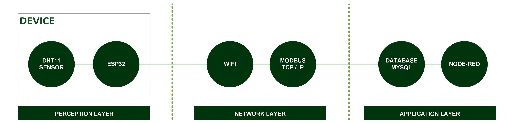
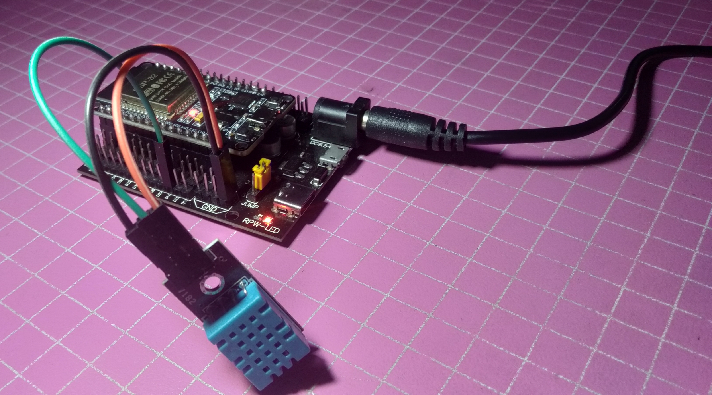

[](https://github.com/ellerbrock/open-source-badges/)
[](https://opensource.org/license/gpl-3.0)


# TH-Monitoring
Dasbor pemantauan lingkungan secara real-time — memantau suhu dan kelembapan dengan fitur pencatatan data historis, penyaringan rentang waktu, ekspor CSV, dan pengelolaan data.

<br><br>

## Kebutuhan Proyek
| Bagian | Deskripsi |
| --- | --- |
| Papan Pengembangan | DOIT ESP32 DEVKIT V1 |
| Editor Kode | Arduino IDE 1.8.19 (Versi Lama yang Stabil) |
| Driver | CP210X USB Driver |
| Dukungan Aplikasi | Node.js |
| Platform Integrasi | Node-RED |
| Protokol Komunikasi | MODBUS TCP/IP |
| Arsitektur IoT | 3 Layer |
| Bahasa Pemrograman | C/C++ |
| Pustaka Arduino | • WiFi (bawaan)<br>• DHT sensor library oleh Adafruit (Versi: 1.4.6)<br>• modbus-esp8266 oleh Alexander Emelianov (Versi: 4.1.0) |
| Palet Node-RED | • node-red (bawaan)<br>• node-red-dashboard<br>• node-red-node-ui-table<br>• node-red-node-mysql<br>• node-red-contrib-modbus |
| Sensor | DHT11: Suhu & Kelembapan Udara (x1) |
| Komponen Lainnya | • Kabel USB Mikro - USB tipe A (x1)<br>• Papan ekspansi ESP32 (x1)<br>• Adaptor DC 9V 1A (x1)<br>• Kabel jumper (1 set) |

<br><br>

## Unduh & Instal
1. Arduino IDE

   <table><tr><td width="810">

   ```
   https://bit.ly/ArduinoIDE_Installer
   ```

   </td></tr></table><br>

2. CP210X USB Driver

   <table><tr><td width="810">
   
   ```
   https://bit.ly/CP210X_USBdriver
   ```

   </td></tr></table><br>

3. NodeJS
   <table><tr><td width="810">

   ```
   https://nodejs.org/en/download/prebuilt-installer
   ```

   </td></tr></table>
   
<br><br>

## Rancangan Proyek

<table>
<tr>
<th width="840">Arsitektur</th>
</tr>
<tr>
<td align="center"></td>
</tr>
</table>
<table>
<tr>
<th width="840">Desain Perangkat Lunak</th>
</tr>
<tr>
<td align="center"></td>
</tr>
</table>
<table>
<tr>
<th width="420">Diagram Ilustrasi</th>
<th width="420">Diagram Blok</th>
</tr>
<tr>
<td align="center"></td>
<td align="center"></td>
</tr>
</table>
<table>
<tr>
<th width="840">Pengkabelan</th>
</tr>
<tr>
<td align="center"></td>
</tr>
</table>

<br><br>

## Pengaturan Arduino IDE
1. Buka ``` Arduino IDE ``` terlebih dahulu, kemudian buka proyek dengan cara klik ``` File ``` -> ``` Open ``` : 

   <table><tr><td width="810">
      
      ``` Code.ino ```
         
   </td></tr></table><br>
   
2. Isi ``` Url Pengelola Papan Tambahan ``` di Arduino IDE

   <table><tr><td width="810">

      Klik ``` File ``` -> ``` Preferences ``` -> masukkan ``` Boards Manager Url ``` dengan menyalin tautan berikut :
      
      ```
      https://dl.espressif.com/dl/package_esp32_index.json
      ```
         
   </td></tr></table><br>
   
3. ``` Pengaturan Board ``` di Arduino IDE

   <table>
      <tr><th width="810">

      Cara mengatur board ``` DOIT ESP32 DEVKIT V1 ```
            
      </th></tr>
      <tr><td width="810">
         
      • Klik ``` Tools ``` -> ``` Board ``` -> ``` Boards Manager ``` -> Instal ``` esp32 ```.

      • Kemudian pilih papan dengan mengklik: ``` Tools ``` -> ``` Board ``` -> ``` ESP32 Arduino ``` -> ``` DOIT ESP32 DEVKIT V1 ```.

      </td></tr>
   </table><br>
   
4. ``` Ubah Kecepatan Papan ``` di Arduino IDE

   <table><tr><td width="810">

      Klik ``` Tools ``` -> ``` Upload Speed ``` -> ``` 115200 ```
         
   </td></tr></table><br>
   
5. ``` Instal Pustaka ``` di Arduino IDE

   <table><tr><td width="810">

      Unduh semua file zip pustaka. Kemudian tempelkan di: ``` C:\Users\Computer_Username\Documents\Arduino\libraries ```
         
   </td></tr></table><br>

6. ``` Pengaturan Port ``` di Arduino IDE

   <table><tr><td width="810">

      Klik ``` Port ``` -> Pilih sesuai dengan port perangkat anda ``` (anda dapat melihatnya di Device Manager) ```
         
   </td></tr></table><br>

7. Ubah ``` Nama WiFi ```, ``` Kata Sandi WiFi ```, dan sebagainya sesuai dengan apa yang anda gunakan saat ini.<br><br>

8. Sebelum mengunggah program, silakan klik: ``` Verify ```.<br><br>

9. Jika tidak ada kesalahan dalam kode program, silakan klik: ``` Upload ```.<br><br>
    
10. Beberapa hal yang perlu anda lakukan saat menggunakan ``` board ESP32 ``` :

    <table><tr><td width="810">
       
       • Jika ``` board ESP32 ``` tidak dapat memproses ``` Source Code ``` secara total -> Tekan tombol ``` EN (RST) ``` -> ``` Restart ```.

       • Jika ``` board ESP32 ``` tidak dapat memproses ``` Source Code ``` secara otomatis maka :<br>

      - Ketika informasi: ``` Uploading... ``` telah muncul -> segera tekan dan tahan tombol ``` BOOT ```.<br>

      - Ketika informasi: ``` Writing at .... (%) ``` telah muncul -> lepaskan tombol ``` BOOT ```.

       • Jika pesan: ``` Done Uploading ``` telah muncul -> ``` Program yang diisikan tadi sudah bisa dioperasikan ```.

       • Jangan tekan tombol ``` BOOT ``` dan ``` EN ``` secara bersamaan karena hal ini bisa beralih ke mode ``` Unggah Firmware ```.

    </td></tr></table><br>

11. Jika masih ada masalah saat unggah program, maka coba periksa pada bagian ``` driver ``` / ``` port ``` / ``` yang lainnya ```.

<br><br>

## Basis data
1. Buka ``` XAMPP ```, lalu tekan tombol mulai di bagian ``` MySQL ``` untuk menjalankan server database secara lokal.<br><br>

2. Akses ``` peramban ``` terlebih dahulu untuk membuka panel admin basis data, silakan salin tautan berikut: ``` localhost/phpmyadmin/ ```.<br><br>
   
3. Buat basis data bernama ``` logger ```.<br><br>

4. Buka basis data ``` logger ``` dan Impor ``` logger.sql ``` di direktori ``` TH-Monitoring/Src/ ```.

<br><br>

## Konfigurasi Node-RED
1. Buka ``` Command Prompt (CMD) ```, lalu masukkan perintah berikut untuk menginstal Node-RED :

   <table><tr><td width="810">

   ```
   npm install -g --unsafe-perm node-red
   ```

   </td></tr></table>

   Tunggu hingga proses instalasi selesai.<br><br>
   
2. Untuk menjaga keamanan Node-RED, Anda perlu mengatur autentikasi dengan menjalankan perintah berikut :

   <table><tr><td width="810">

   ```
   node-red admin init
   ```

   </td></tr></table>

   Silakan pilih opsi seperti yang ditunjukkan pada bagian ``` Node-RED Authentication ``` di bagian Sorotan. Untuk username dan password, silakan tentukan sendiri sesuai kebutuhan.<br><br>
   
3. Selanjutnya, jalankan Node-RED menggunakan perintah berikut :

   <table><tr><td width="810">

   ```
   node-red
   ```

   </td></tr></table>

   Tunggu hingga proses inisialisasi selesai dan muncul pesan yang menunjukkan bahwa server telah berhasil dimulai.<br><br>

4. Setelah itu, Node-RED siap diakses melalui browser web menggunakan alamat IP perangkat pada port 1880.<br><br>

5. Kemudian, login menggunakan akun yang telah Anda konfigurasikan sebagai langkah keamanan di Node-RED.<br><br>

6. Instal semua palet Node-RED yang diperlukan.<br><br>

7. Buka menu ``` Import ``` di Node-RED, lalu impor ``` flow_nodered.json ``` di direktori ``` TH-Monitoring/Src/ ```. Pastikan semua flow Node-RED telah berhasil dimuat.<br><br>

8. Kemudian, untuk menjalankan flow tersebut, klik ``` Deploy ```.

<br><br>

## Memulai
1. Unduh dan ekstrak repositori ini.<br><br>
   
2. Pastikan anda memiliki komponen elektronik yang diperlukan.<br><br>
   
3. Pastikan komponen anda telah dirancang sesuai dengan diagram.<br><br>
    
4. Konfigurasikan perangkat anda menurut pengaturan di atas.<br><br>

5. Selamat menikmati [Selesai].

<br><br>

## Sorotan

<table>
<tr>
<th width="840">Perangkat</th>
</tr>
<tr>
<td align="center"></td>
</tr>
</table>
<table>
<tr>
<th width="840" colspan="2">Autentikasi Node-RED</th>
</tr>
<tr>
<td width="420" align="center"></td>
<td width="420" align="center"></td>
</tr>
<tr>
<td width="840" colspan="2" align="center"></td>
</tr>
</table>
<table>
<tr>
<th width="840">Dasbor Node-RED</th>
</tr>
<tr>
<td align="center"></td>
</tr>
</table>

<br>
<strong>Informasi lebih lanjut:</strong> <a href="https://github.com/cakraawijaya/TH-Monitoring/blob/master/Assets/Documentation/Report/Portofolio%20Pelatihan%20Sertifikasi%20BNSP%20IIoT%20-%20Devan%20Cakra%20Mudra%20Wijaya-49-62.pdf"><u>Klik Disini</u></a>

<br><br><br>

## Apresiasi
Jika karya ini bermanfaat bagi anda, maka dukunglah karya ini sebagai bentuk apresiasi kepada penulis dengan mengklik tombol ``` ⭐Bintang ``` di bagian atas repositori.

<br><br>

## Penafian
Aplikasi ini merupakan hasil pengembangan dari Bootcamp Edutic.id x BNSP 2026. Saya tidak memungkiri bahwa saya masih menggunakan layanan pihak ketiga dalam pengerjaan ini, antara lain: library, framework, dan lain sebagainya.
